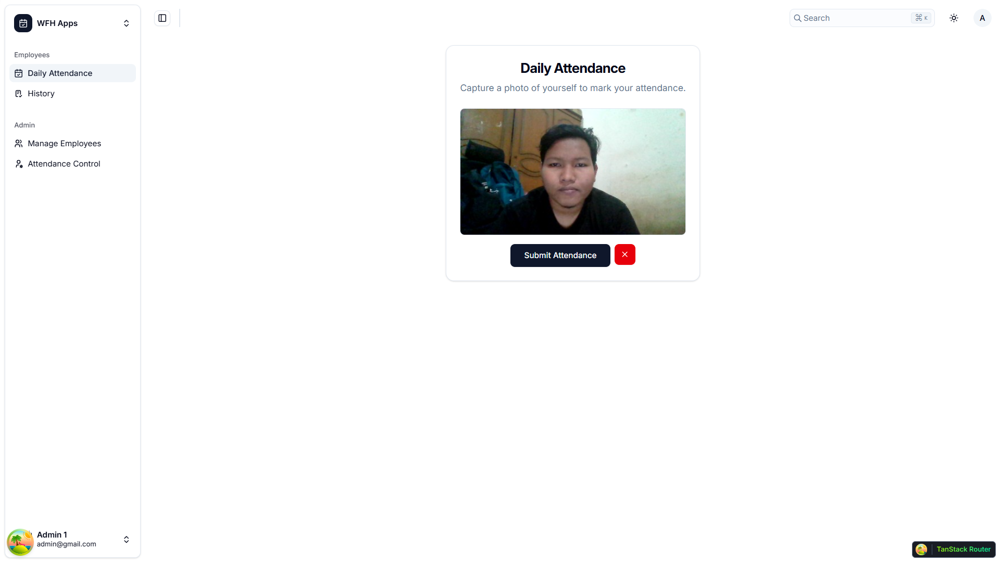
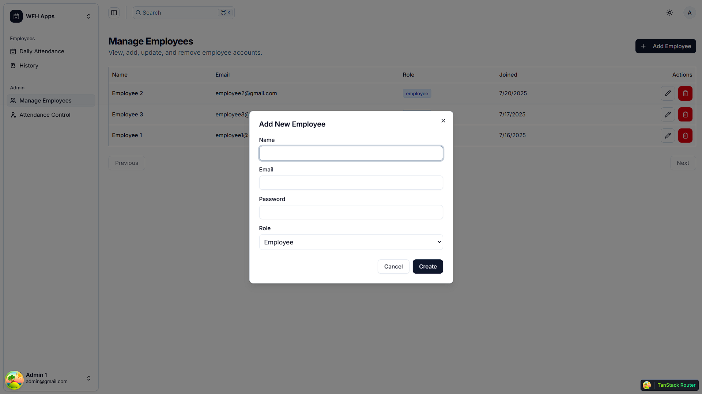
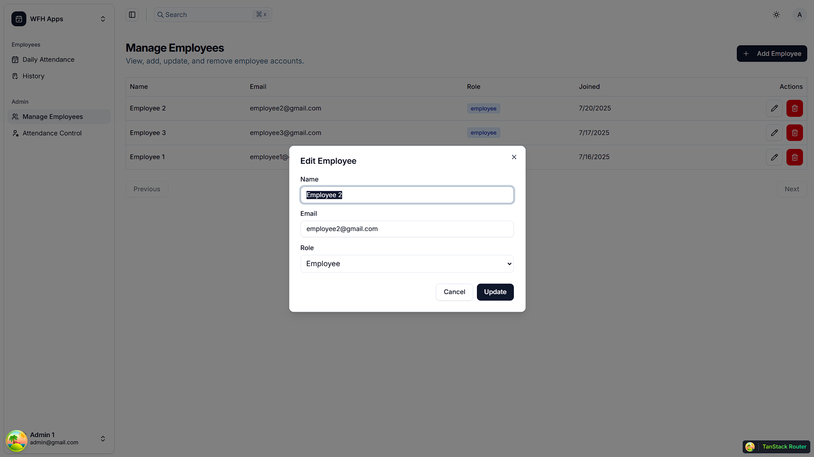

# 🖥️ Aplikasi Absensi WFH - Frontend

Aplikasi **frontend (client-side)** untuk platform **Absensi WFH**.  
Aplikasi ini berinteraksi dengan backend **microservices** seperti **User Service** & **Attendance Service** untuk menyediakan antarmuka pengguna yang interaktif.

---

## ✨ Tampilan

- Login Page (Admin dan Karyawan)

  

- Daily Attendance (Admin dan Karyawan)

  
  

- Attendance History (Admin dan Karyawan)

  

- Manage Employees (Admin)

  

- Attendance Control (Admin)

  

- Modal Add Employee (Admin)

  

- Modal Edit Employee (Admin)

  

- Modal Delete Employee (Admin)

  

## ✨ Fitur Utama

✅ **Login Page**  
Halaman login untuk masuk ke aplikasi menggunakan JWT.

✅ **Daily Attendance**  
Halaman utama setelah login, menampilkan fungsi absensi harian (take photo atau upload photo)

✅ **History**  
Halaman History untuk melihat riwayat absensi.

✅ **Manage Employees (Admin)**  
Halaman untuk manajemen karyawan (admin) untuk menambah, mengubah, atau menghapus karyawan.

✅ **Attendance Control**  
Halaman (view) untuk melihat riwayat absensi karyawan (admin).

---

## 🚀 Teknologi yang Digunakan

- **[Vite](https://vitejs.dev/)** → Build tool modern untuk React
- **[React](https://react.dev/)** → Library untuk membangun antarmuka pengguna
- **[TanStack Router](https://tanstack.com/router)** → Type-safe routing untuk React
- **[Axios](https://axios-http.com/)** → Client HTTP untuk komunikasi API backend
- **[shadcn/ui](https://ui.shadcn.com/)** → Komponen UI yang reusable
- **[Tailwind CSS](https://tailwindcss.com/)** → Framework CSS untuk styling
- **[Lucide React](https://lucide.dev/)** → Library ikon ringan & modern
- **[js-cookie](https://github.com/js-cookie/js-cookie)** → Mengelola JWT (token otentikasi) di browser

---

## ⚙️ Cara Install & Jalankan

### 1. Clone Repository

```bash
git clone https://github.com/ihsanmarseno/wfh-app-frontend.git
cd /wfh-app-frontend
```

### 2. Install Dependencies

```bash
npm install
```

### 3. Setup Environment Variables

```bash
VITE_USER_SERVICE_URL=http://localhost:5001
```

### 6. Running Server

```bash
npm run dev
```
